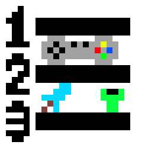

# Listopia Documentation

The website is available at: [https://listopia-frontend.netlify.app](https://listopia-frontend.netlify.app)

## List Of Contents

- [Short Explanation Of The Software](#short-explanation-of-the-software)
- [Development](#development)
- [Requirements](#requirements)
- [Features & Usage Guide](#features--usage-guide)
- [How It Works](#how-it-works)
- Screenshots in the repository for pages that aren't accessible if the user isn't logged in or isn't an admin

## Short Explanation Of The Software

- ### What Is Listopia?

  - Listopia is a social website for creating recommendation lists

- ### Target Audience
  - Currently we're focusing on gaming so our users would most likely be gamers
    - The site could contain other topics as well but we wanted to make something all of us are familiar with (and with what services are available to us)
- ### Design
  - Most of the website is designed to be responsive and usable on both desktop and mobile devices
  - The Admin Panel is designed for desktop use as it contains a lot of information that would be hard to display on smaller screens
  - We're trying to use semantic HTML to improve accessibility

## Development

- We're using GitHub Projects To Track Issues & Our To-Do List
  - [Frontend](https://github.com/orgs/ListopiaTeam/projects/2)
  - [Backend](https://github.com/orgs/ListopiaTeam/projects/3)
- Code is formatted using Prettier - `bunx prettier --write .`
- There are some tests available as well - `bunx vitest`

## Requirements

- Modern Web Browser
  - Currently the website works best on larger screens but most of it is usable on mobile as well
- Active Internet Connection
- Registration To Access All Features (Email, Username, Password & Optional Profile Picture)
  - Account and content made by users can be deleted by the user themselves or by admins

## Features & Usage Guide

- ### Lists

  - **_The Main Feature & Purpose Of The Site_**
  - #### Creating A List:
    - Automatically Selected Image From The First Game Contained In The List
    - Tags
    - Title
    - Description
    - Games
    - Option To Submit To Current Event
  - #### Browsing Lists:
    - Search by title
    - Filter by categories
    - Order by creation date, like count and alphabetically
  - #### List Details:
    - Clicking on the games included in a created list shows a modal with the games' details
  - #### Sharing Lists:
    - On the lists' details page there is a share button which copies the lists' URL for easy sharing
    - There is metadata containing basic information about Listopia for better embeds

- ### Events

  - #### User-side
    - These are made so users can collectively submit to one current theme
    - Top 3 liked lists are separated from the rest
    - There is a deadline for submission and only newly created lists can participate
      - After the deadline is over, events get archived
  - #### Admin-side
    - Admins can create events inside the Admin panel
      - Events require: name, description, deadline, and an image

- ### Social Features

  - #### Commenting & Replying

    - Users are able to comment under lists and are even able to reply under them
      - Comments and replies have the commenter's username, profile picture and the comment's creation date attached
    - Replies are limited to one level only to keep the comment section simple
      - Replies are hidden by default and can be viewed by clicking the "**View _`amount of replies`_ reply / replies**" button

  - #### Liking Content
    - Lists can be liked by users
      - Example reasons why a user would use liking:
        - Show appreciation to / agreement with the creator
        - Help ranking lists in events
        - Add the list to liked lists page "to save it for later"
    - Top 3 most liked lists are shown on the home page

- ### Moderation

  - #### How To Become An Admin

    - Add `isAdmin` boolean to an user with `true` value in Firebase (Users collection)

  - #### Reporting Content

    - Users have the option to report lists for various reasons if they see the content doesn't fit the site
    - Reports can only be sent once per list
      - Some reasons for reporting include: "Hate Speech", "Spam", "Misinformation" etc...

  - #### Admin Tools
    - Reported content goes into a moderation queue
      - Admins here can decide if the content fits the site or not
        - If it doesn't fit the site, the content can be removed
        - If it's a false report, the content gets "approved" and gets cleared from the queue
    - Problematic users can be deleted inside the Admin Panel

- ### User Profile

  - #### Profile Settings

    - Set Username
    - Set Profile Picture
    - Delete Account

  - #### Own Lists

    - Shows lists made by the current user logged in
    - Ordered by creation date (From most recent to older)

  - #### Liked Lists
    - Shows liked lists of the current user logged in
    - Ordered by like count (From most liked to least likes)

- ### Navigation
  
  - #### Navbar
    - Clicking the Listopia icon on the navbar makes the user go to the home page
    - The navbar indicates which page the user is currently on with a ">" and red highlight
      - When on the home page or profile page "LISTOPIA" or the logged in user's name gets underlined instead
  
  - #### Buttons
    - There is a "go back" button when the user clicks on a list for more details to go back to browsing
      - For admins this can also go back to the admin panel instead if they visit the list from a report
    - There is a "scroll top" button when the user isn't at the top of the page
    - There is an error page with a back button if a requested page cannot be found
    - The "Create A List!" / "Join The Event" button on the home page is disabled if the user isn't logged in

  - #### Events
    - If there is no active event, the link in the navbar changes from "Current Event" to "Archived Events" and the button to navigate to it on the home page disappears as well
    - If there is an active event, the "Create A List!" button changes to "Join The Event" and an "Event Details" button appears as well

- ### Other Features

  - #### Admin Panel
    - View Schemas
      - Firestore Inspector
    - View Latest Test Result Summary
      - Displays the `test-results.json` file's contents
    - The "Create Event" button is disabled if there is an already active event
  - #### Security
    - Users can request to reset their password on the login page
  - #### Filtering
    - "Unknown", "non-rated" and other games not fitting the site (eg. pornographic content) are hidden from search results
  - #### Limits
    - Usernames, passwords and other text fields (eg. comments) have a minimum and maximum length requirement
  - #### Effects
    - Various hover animations for interactive elements (mostly buttons and links)
    - White fade-in-out transition when switching between pages

## How It Works

- ### Services Used

  - Firebase (Database & Auth)
  - RAWG API (Game Data)
  - Cloudinary (Image Hosting)

- ### Frontend

  - #### Hosting: Netlify (Free Tier)

    - Automatically updates when changes are made to this repository

  - #### Technologies:
    - Frameworks:
      - React
      - TailwindCSS + HyperUI
    - Other packages (React Query, Axios etc...)
    - Vite (Build Tool & Dev Server)
    - Bun (Package Management)
    - Prettier (Code Formatting)

- ### Backend

  - #### Hosting: Self-hosting at home (Linux Server with Docker Containers)
    - Automatically updates when changes are made to the backend repository
    - Has custom domain
  - #### Technologies:
    - Bun (Package Management & Javascript Runtime)
    - Packages:
      - Express
      - Cors
      - Firebase-admin
      - Cloudinary
